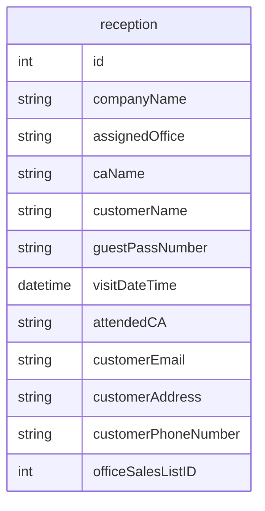

## 画面設計

### 受付画面

- 予約済みリストを表示（下半分くらい）
- 企業名等で検索（余裕があればQRで）
- リストにない来場者の新規登録
    - 企業名(companyName)，お客様名(customerName)，所在地のエリア(customerAddress)

### BACK画面

- 来場者を表示（営業所名(assignedOffice)，営業担当者名(caName)）
- アテンドしたときにチェックを押す
    - アテンドした際に担当した人の名前を記録

## API設計

- /api/

## DB設計

