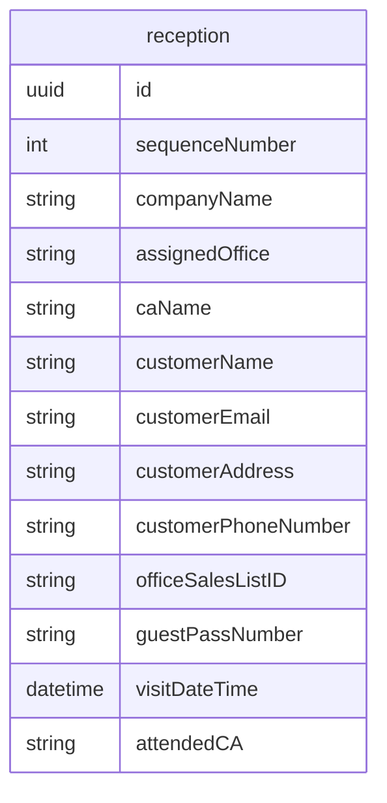

## 画面設計

### 受付画面(/reception)

- 企業名で検索（余裕があればQRで）
- 予約済みリストを表示（下半分くらい）
- 来場処理
    - 企業名とお客様氏名を表示し，OKかキャンセルをクリックさせる
    - 操作する対象はReceptionListでクリックされた人 or 新規登録された人
    - 行う操作
        - vistDateTimeに現在時刻を登録
        - 「同行していますか？」のチェックボックスがtrueのとき，attendedCAにcaNameを入れる
- リストにない来場者の新規登録 & 来場処理
    - 企業名(companyName)，お名前(customerName)，所在地のエリア(customerAddress)

### BACK画面(/show)

- 来場したが，CAがアテンドしていないお客様を表示する
- 来場者を表示
    - リストに登録済みの場合（企業名(companyName),  お客様名(customerName), 営業所名(assignedOffice), 営業担当者名(caName)）
    - 新規登録の場合（企業名(companyName),  お客様名(customerName), 所在地(customerAddress)）
- アテンドしたときにボタンを押す
    - ダイアログを表示して，アテンドした人の名前を記録

### 設定画面(/setting)

- receptionのcsv経由でのインポート/エクスポートを行う

## API設計(/api)

- /api/reception

## DB設計

